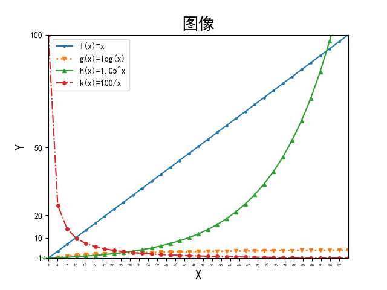

# Lab1

> Name: 张展翔
>
> Student Number: PB20111669

## 实验题目

绘图

## 实验环境

Windows 11

python 3.92

vscode

## 实验目的

熟练运用python的绘图功能

## 实验内容

使用pylab/matplotlib库进行绘图，绘制1≤x≤100范围内f(x)=x，g(x)=log(x)，h(x)=1.05^x，k(x)=100/x四个函数的图表。所有曲线绘制在同一张图表中，要求绘制的图表包含图标题和坐标轴标题，实验代码中需要设置字体大小、数字大小、坐标轴刻度大小以及标记点大小。曲线的图表需要对每一条曲线进行标注。

## 代码分析

```python
plt.rcParams['font.sans-serif']=['SimHei']
plt.rcParams['axes.unicode_minus']=False
```

首先，使用rcParams设置字体为SimHei，并避免保存图像的乱码问题

```python
plt.title("图像",fontsize=20)
```

设置图像标题

```python
plt.xlim(1,100)
plt.ylim(1,100)
```

设置坐标轴范围

```python
plt.xlabel('X',fontsize=15)
plt.ylabel('Y',fontsize=15)
```

设置坐标轴名称和字体大小

```python
my_x_ticks=np.arange(1,100,3)
plt.xticks(my_x_ticks,fontsize=5)
plt.yticks([1,10,20,50,100])
```

设置坐标轴刻度，数字大小

```python
x=np.linspace(1,100,33)
y=x
z=np.log(x)
k=1.05**x
p=100/x
plt.plot(x,y,label='f(x)=x',marker='.',ms=5)
plt.plot(x,z,':',linewidth='2',label='g(x)=log(x)',marker='v',ms=4)
plt.plot(x,k,'-',label='h(x)=1.05^x',marker='^',ms=4)
plt.plot(x,p,'-.',label='k(x)=100/x',marker='o',ms=4)
```

绘制函数图像，并且对不同曲线采用label进行标注，用marker对不同图像添加标记点，并用ms来控制标记点的大小


## 实验结果



## 实验收获及建议

在本次小实验中，我学习并运用了python中matplotlib库，并用其绘制了函数图像；

实验内容部分表述可能不够清晰，例如数字大小（很难理解什么地方的数字大小），曲线标注（不知道是对每条曲线进行说明还是直接在图表上添加标记信息）等