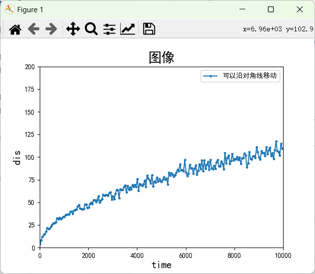

# Lab2

> Name: 张展翔
>
> Student Number: PB20111669

## 实验题目

二位随机游走

## 实验环境

Windows 11

Anaconda3

pycharm

## 实验目的

使用python模拟二位随机游走过程，处理不确定性问题。

## 实验内容

本题代码参照了教材二维随机游走部分的醉汉问题，所建的类与教材内容类似，不做过多说明

部分函数分析：

通过walk函数实现了对指定时间内游走距离原点的计算

```python
def walk(f, d, numSteps): 
    start = f.getLoc(d) 
    for s in range(numSteps): 
        f.moveDrunk(d) 
    return start.distFrom(f.getLoc(d))
```

通过simWalks对同一时间进行多次模拟，进行期望的计算

```python
def simWalks(numSteps, numTrials, dClass):  
    Homer = dClass() 
    origin = Location(0, 0) 
    distances = [] 
    for t in range(numTrials): 
        f = Field() 
        f.addDrunk(Homer, origin) 
        distances.append(round(walk(f, Homer, numSteps), 1)) 
    return distances
```

通过对不同步长函数的设置，来实现有偏随机游走、不同方向概率不同，多方向等

```python
    def takeStep(self):
        stepChoices = [(0, 1), (0, -1), (1, 0), (-1, 0)]
        # stepChoices = [(0.0,1.0), (0.0,-2.0), (1.0, 0.0),(-1.0, 0.0)] #向下的步长为其他方向两倍
        # stepChoices = [(1.0, 0.0), (-1.0, 0.0)] #只能向左或向右
        # stepChoices = [(0,1), (0,-1), (1, 0), (-1, 0),(1,1),(1,-1),(-1,-1),(-1,1)] #可以沿对角线移动
        # stepChoices = [(0, 1), (0, -1), (1, 0), (-1, 0),(0,1)] # 向右的概率为其它方向的两倍
        return random.choice(stepChoices)
```

关于回到原点的期望次数,只需在期望函数中增加一个记录当期望距离为0时的计数器记录即可，但是由于其为离散的（数据很少），故不作绘图

若要求第一次回到原点的期望时间，可以再增加一个全局变量记录当times==1 时的numSteps即可

```python
def drunkTest(walkLengths, numTrials, dClass):
    dis=[]
    times=0
    for numSteps in walkLengths: 
        distances = simWalks(numSteps, numTrials, dClass) 
        print(dClass.__name__, 'random walk of', numSteps, 'steps')
        # print(' Mean =', round(sum(distances)/len(distances), 4))
        # print(' Max =', max(distances), 'Min =', min(distances))
        # if round(sum(distances)/len(distances))==0:
        #     times+=1
        dis.append(round(sum(distances)/len(distances),4))
    return dis,times
```


关于绘图函数的实现在实验一中有着较为详细的分析，故不单独说明

其余具体类及函数实现参照代码

## 实验结果

（ps由于运行时间实在太长了因此每50取一个x值来减少运行时间）

第一张图将x距离原点的期望距离与两个不同情况的有偏随机游走结合起来


第二张图则是向右移动的概率为其他方向两倍的情况下距离原点的期望距离随时间的变化


第三张图则是增加了可以沿对角线移动的情况下距离原点的距离随时间变化的图像



## 实验收获及建议

本次实验让我很好的学习了python语言中类，函数等应用并用于模拟现实世界中的一些复杂问题，并且复习了实验1中的利用matplotlib库作图的方法。

由于10~10000s之间执行次数实在过多导致可能花费大量时间，建议可以设置一定的步长来减少运行时间，且关于回到原点的图像无法绘制可以更改一些其他的提问方法等等