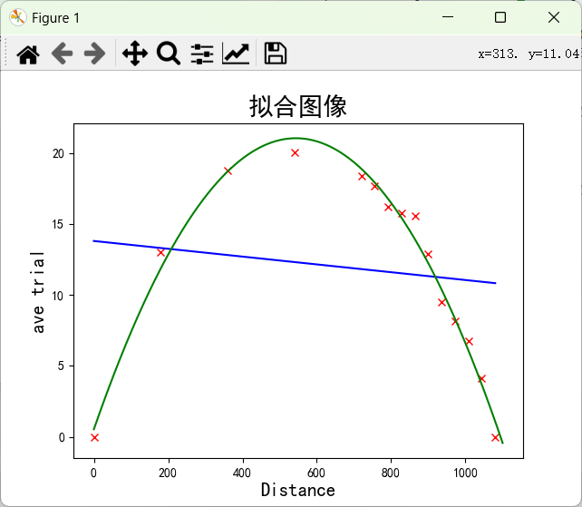

# Lab3
## 实验题目
实验四：理解实验数据（弹丸实验）
## 实验目的
使用python处理实验数据。
## 实验环境
Win11
Anaconda3
pycharm2023.1
## 实验内容
使用一种弹丸装置向1080英寸之外的目标发射4次弹丸，测量出弹丸距离发射点不同距离时的高度。实验数据如以下表格所示，第一列为弹丸与发射点之间的距离，其他各列为4次实验中弹丸在相应距离时的高度。

对实验数据进行最小二乘法的线性拟合以及二次拟合，完成两种拟合绘图并分析结果。
## 主要代码分析
首先将数据导入到data列表中，然后构造`preprocess`函数对数据进行求平均值处理并分别放入`x，y`列表中返回
```python
def preprocess(data):
    x=[]
    y=[]
    for i in data:
        x.append(i[0])
        y.append(np.average(i[1:5]))
    return x,y
```
然后再利用 `draw`函数对图像分别进行一次和二次拟合
```python
def draw(x,y):
    plt.rcParams['font.sans-serif'] = ['SimHei']
    plt.rcParams['axes.unicode_minus'] = False
    plt.title("拟合图像", fontsize=20)
    plt.xlabel('Distance', fontsize=15)
    plt.ylabel('ave trial', fontsize=15)
    xrange=np.linspace(0,1100,100000)
    plt.plot(x,y,'rx')
    coeff=polyfit(x,y,1)# 一次拟合求系数
    y2=[]
    for i in x:
        y2.append(coeff[0]*i+coeff[1])
    coeff=polyfit(x,y,2)# 二次拟合求系数
    y3=np.polyval(coeff,xrange)
    plt.plot(x,y2,'-b')
    plt.plot(xrange,y3,'g')
    plt.show()
```
## 实验结果

由散点图和拟合图像可以看出，采用二次拟合的效果更加符合实际情况